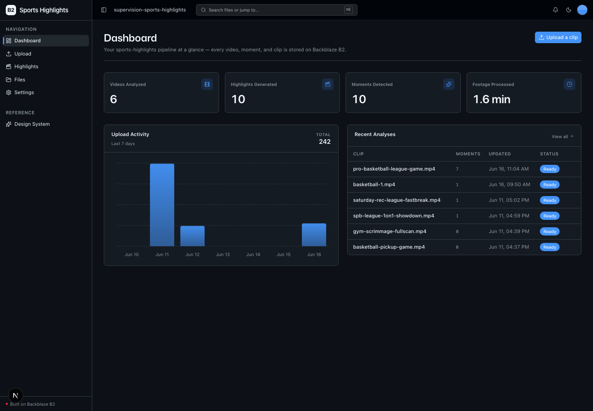
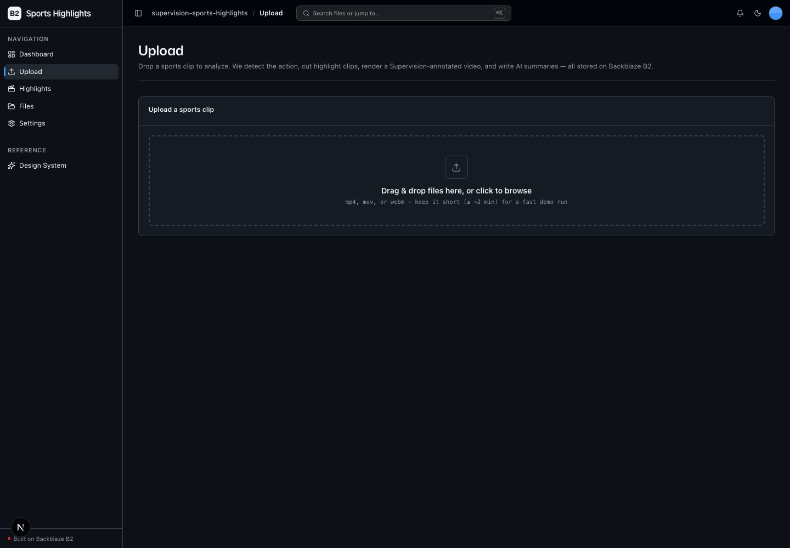
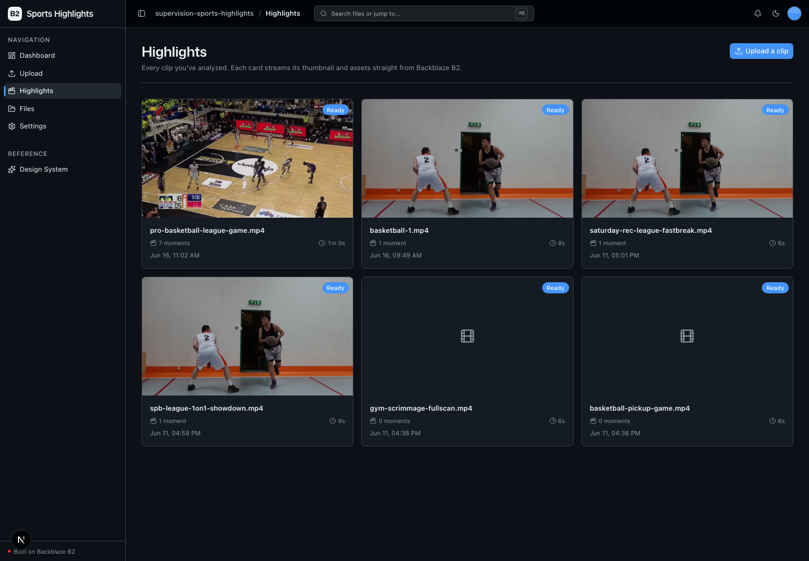
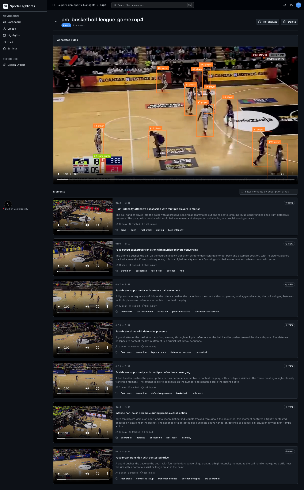

<!-- last_verified: 2026-06-11 -->
# Supervision Sports Highlights

Turn a raw sports clip into a searchable library of highlights. Upload a video
to **[Backblaze B2](https://www.backblaze.com/sign-up/ai-cloud-storage?utm_source=github&utm_medium=referral&utm_campaign=ai_artifacts&utm_content=b2ai-supervision-sports-highlights)**, and the backend runs a real computer-vision
pipeline — **Roboflow Inference** for object detection, **Roboflow Supervision**
for multi-object tracking and annotation — to find the action, cut a highlight
clip at each key moment, render a Supervision-annotated version of the video,
and use **Claude** to write a short summary and searchable description for every
moment. Every artifact — source footage, clips, the annotated video, per-moment
analysis, summaries, and the search index — lives on and streams back from B2
over the S3 API.

It's a concrete, end-to-end example of B2 as the storage layer for a
media-processing pipeline, for developers exploring computer vision, sports
analytics, and video-AI workflows.

## What it looks like

**Dashboard** — pipeline metrics (videos analyzed, highlights, moments, footage minutes), a 7-day upload-activity chart, and a recent-analyses table with live status.



**Upload** — drag-and-drop a short sports clip to kick off the detect → track → clip → annotate → summarize pipeline.



**Highlights Library** — a grid of analyzed videos, each card showing a keyframe thumbnail, moment count, and status, streamed straight from B2.



**Analysis detail** — the Supervision-annotated video plus a moment timeline, each moment with its highlight clip, AI summary, detection/track stats, and tags.



## How it works

1. **Upload** a short sports clip on `/upload` → stored on B2.
2. The pipeline runs asynchronously: probe → **detect + track** (Roboflow) →
   **moment detection** → **cut clips** (ffmpeg) → **annotate** (Supervision) →
   **summarize** (Claude). Status is persisted to a `manifest.json` on B2 at
   each stage.
3. **Browse** the results in the **Highlights Library** (`/highlights`): the
   annotated video streams straight from a presigned B2 URL, and each moment
   shows its highlight clip, AI summary, tags, and detection/track stats. A
   search box filters moments by description or tag.

## Honest scoping (read this first)

This is a **real** CV pipeline, not a mock:

- **Roboflow Inference runs the model locally** on CPU/GPU, so a full demo run
  takes **minutes, not seconds**. Use **short clips (≤ ~2 min)**.
- The Python install is **heavy** — the `inference` runtime pulls
  opencv/onnxruntime/numpy. First run also **auto-downloads** the model weights.
- **ffmpeg/ffprobe are system binaries**, not pip packages — install them
  separately (see Setup).

## Tech Stack

- **CV core:** [Roboflow Inference](https://inference.roboflow.com/) (model
  runtime) + [Roboflow Supervision](https://supervision.roboflow.com/)
  (ByteTrack tracking + Box/Label/Trace annotators). The default
  `rfdetr-base` COCO model includes `person` and `sports ball`, so it works on
  any ball sport with **zero training and no API key**.
- **AI summaries:** [Anthropic Claude Haiku](https://www.anthropic.com/) — text
  only, from detection/track metadata (~$0.03–0.05 per full demo run).
- **Media:** ffmpeg/ffprobe (probe, clip cutting, annotated-video encode).
- **Web:** TypeScript, Next.js 16, React 19, Tailwind v4, shadcn/ui, TanStack
  Query, Recharts.
- **API:** Python 3.11+, FastAPI, boto3, Pydantic v2 — strict layered
  architecture (`types → config → repo → service → runtime`) with structural
  tests.
- **Storage:** Backblaze B2 (S3-compatible) — the **sole** data store. No
  database, no job queue.

## Quick Start

You need: Node.js >= 20, pnpm >= 9, Python >= 3.11, **ffmpeg/ffprobe on your
PATH**, and a free **[Backblaze B2 account](https://www.backblaze.com/sign-up/ai-cloud-storage?utm_source=github&utm_medium=referral&utm_campaign=ai_artifacts&utm_content=b2ai-supervision-sports-highlights)**. An `ANTHROPIC_API_KEY` is recommended (for AI summaries) but
optional — the pipeline degrades gracefully without it.

### Setup

**1. Install ffmpeg** (system binary, required by the pipeline)

```bash
# macOS
brew install ffmpeg
# Debian/Ubuntu
sudo apt install ffmpeg
```

**2. Install JS dependencies**

```bash
pnpm install
```

**3. Set up the backend** (heavy — the `inference` runtime is large)

```bash
cd services/api
python -m venv .venv && source .venv/bin/activate
pip install -r requirements.txt
cd ../..
```

**4. Add your credentials**

```bash
cp .env.example .env
```

Open `.env` and fill it in. Head to the [Backblaze B2 dashboard](https://secure.backblaze.com/b2_buckets.htm?utm_source=github&utm_medium=referral&utm_campaign=ai_artifacts&utm_content=b2ai-supervision-sports-highlights) and:

1. **Create a bucket.** Paste the values into `.env`:
   - **Bucket Unique Name** → `B2_BUCKET_NAME`
   - **Region** → `B2_REGION` (e.g. `us-west-004`; the S3 endpoint is derived from this)
   - **Public URL base** → `B2_PUBLIC_URL_BASE` (e.g. `https://my-sports-highlights.s3.us-west-004.backblazeb2.com`)
2. **Create an application key** with `Read and Write`. Paste:
   - **keyID** → `B2_APPLICATION_KEY_ID`
   - **applicationKey** → `B2_APPLICATION_KEY` *(only shown once)*
3. *(Recommended)* Set `ANTHROPIC_API_KEY` for AI moment summaries.
   *(Optional)* Set `ROBOFLOW_API_KEY` only if you want sport-specific
   [Roboflow Universe](https://universe.roboflow.com/) models or hosted
   inference — pre-trained COCO models need **no** key. Universe models emit
   custom labels, so also set `DETECTION_PERSON_CLASSES` /
   `DETECTION_BALL_CLASSES` (comma-separated) to map them onto the
   person/ball highlight heuristic — see `.env.example`.

> Walkthroughs: [creating a bucket](https://www.backblaze.com/docs/cloud-storage-create-and-manage-buckets?utm_source=github&utm_medium=referral&utm_campaign=ai_artifacts&utm_content=b2ai-supervision-sports-highlights) · [creating app keys](https://www.backblaze.com/docs/cloud-storage-create-and-manage-app-keys?utm_source=github&utm_medium=referral&utm_campaign=ai_artifacts&utm_content=b2ai-supervision-sports-highlights).

**5. Run it**

```bash
pnpm dev
```

Frontend at `localhost:3000`, API at `localhost:8000`. `pnpm dev` runs
`pnpm doctor` first — a preflight that checks Node/Python/pnpm versions, the
venv, your `.env`, **ffmpeg on PATH**, and warns if `ANTHROPIC_API_KEY` is
missing. Run it standalone any time with `pnpm doctor`.

Upload a short clip, watch the pipeline run on the Highlights detail page, and
explore the moments.

## B2's role in this pipeline

B2 is the only data store — there is no database. Every pipeline artifact is an
object under a per-app prefix, and the browser streams media **directly** from
presigned B2 GET URLs (range-friendly, so video seeking works without proxying
bytes through the API):

```
supervision-sports-highlights/videos/{video_id}/
  source.{ext}              # uploaded source footage
  manifest.json             # pipeline status + moment index (= search index)
  annotated.mp4             # Supervision-annotated full video
  clips/moment-{n}.mp4      # highlight clips
  moments/moment-{n}.json   # per-moment detection/track analysis
  summaries/moment-{n}.txt  # Claude (or templated) summary
  thumbs/moment-{n}.jpg      # representative keyframe
```

All storage goes through the **S3-compatible API** (boto3), with the endpoint
derived from `B2_REGION`. A single client factory carries the custom user agent
`b2ai-supervision-sports-highlights (backblaze-b2-samples)`.

## Core Features

- [Sports Video Upload](docs/features/file-upload.md) — drag-and-drop upload of
  a clip to B2.
- [Video Analysis](docs/features/video-analysis.md) — Roboflow detection +
  ByteTrack tracking → key-moment timeline.
- [Highlights & Annotation](docs/features/highlights-and-annotation.md) — ffmpeg
  clips per moment + a Supervision-annotated render, stored on B2.
- [AI Summaries & Search](docs/features/ai-summaries-and-search.md) — Claude
  writes a summary + tags per moment; search across all moments.
- [Highlights Library](docs/features/highlights-library.md) — scoped asset
  explorer streaming every generated asset from B2.
- [File Browser](docs/features/file-browser.md) — full-bucket explorer
  (unchanged starter feature).
- [Dashboard](docs/features/dashboard.md) — pipeline metrics + live analysis
  status.

## Commands

| Command | What it does |
|---------|-------------|
| `pnpm dev` | Start frontend + backend |
| `pnpm dev:web` | Frontend only |
| `pnpm dev:api` | Backend only |
| `pnpm build` | Build frontend |
| `pnpm lint` | Lint frontend |
| `pnpm lint:api` | Lint backend (ruff) |
| `pnpm test:api` | Run backend tests |
| `pnpm check:structure` | Verify layering rules |
| `pnpm test:e2e` | Playwright e2e tests (run `pnpm --filter @supervision-sports-highlights/web exec playwright install chromium` once first) |

## Documentation Map

| Doc | Purpose |
|-----|---------|
| [AGENTS.md](AGENTS.md) | Agent table of contents — start here |
| [ARCHITECTURE.md](ARCHITECTURE.md) | Pipeline stages, layering, data flows, B2 layout |
| [docs/features/](docs/features/) | Feature docs |
| [docs/app-workflows.md](docs/app-workflows.md) | User journeys |
| [docs/dev-workflows.md](docs/dev-workflows.md) | Engineering workflows and testing |
| [docs/SECURITY.md](docs/SECURITY.md) | Security principles |
| [docs/RELIABILITY.md](docs/RELIABILITY.md) | Reliability expectations |

## License

MIT License - see [LICENSE](LICENSE) for details.

## Built with the Vibe Coding Starter Kit

This app was scaffolded from the
[vibe-coding-starter-kit](https://github.com/backblaze-b2-samples/vibe-coding-starter-kit) —
a B2-backed full-stack template. The starter's UI kit, file browser, upload
flow, and layered backend remain; the CV pipeline, Highlights Library, and
dashboard are this app's additions.

## Claude Agent B2 Skill

Manage Backblaze B2 from your terminal using natural language (list/search,
audits, stale or large file detection, security checks, safe cleanup).

Repo: [https://github.com/backblaze-b2-samples/claude-skill-b2-cloud-storage](https://github.com/backblaze-b2-samples/claude-skill-b2-cloud-storage)
